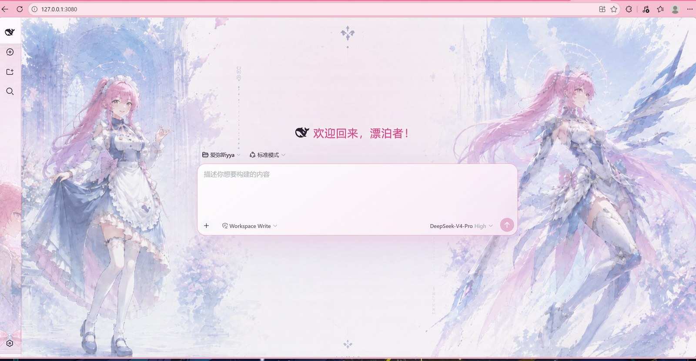
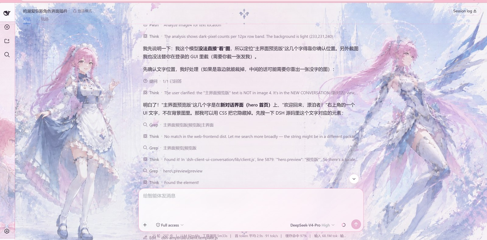

# 爱弥斯 · 电子幽灵（Amis · Electronic Ghost）

面向 DeepSeek Harness Web 的非官方、非商业《鸣潮》爱弥斯（Amis）同人皮肤。以品红粉与霓虹青重塑界面：侧边栏展示爱弥斯全身立绘，主界面使用爱弥斯主题壁纸作为聊天背景。

## 效果预览





## 功能

- 侧边栏：爱弥斯立绘作为侧边栏背景（明 / 暗双模式）
- 主界面：爱弥斯主题壁纸作为聊天背景（自适应 cover 填充）
- 品红 × 霓虹青配色：品牌色、边框、按钮、滚动条、选区全部爱弥斯化
- 明暗双模式自动适配
- 首页欢迎语替换为「欢迎回来，漂泊者！」
- 支持 `prefers-reduced-motion`，卸载时完整还原 DOM、样式与观察器

## 安装

前提：已安装 DeepSeek Harness（`npx @deepseek-ai/dsh`）。

```powershell
# 方式一：克隆本仓库后，从本地路径安装
git clone <仓库地址> dsh-amyth
npx @deepseek-ai/dsh plugin --profile web add ".\dsh-amyth"

# 方式二：直接以仓库地址安装（若支持）
npx @deepseek-ai/dsh plugin --profile web add <仓库地址>

npx @deepseek-ai/dsh web
```

安装后若同时存在其它皮肤，请编辑 `~/.dsh/profiles/web/cordis.patch.yml`，给其它皮肤行加 `disabled: true`，避免多个皮肤叠加背景。

## 目录结构

```
dsh-amyth/
├── package.json            # dsh 插件包元数据
├── skin.json               # 皮肤元数据
├── cordis.patch.yml        # 挂载补丁
├── lib/
│   ├── index.js            # Host 入口（空实现）
│   ├── client.js           # 构建产物（素材已内嵌 base64）
│   └── client.template.js  # 源码模板
├── scripts/
│   ├── prepare-assets.cjs  # 素材处理（裁剪 / 抠图 / 压缩）
│   └── embed-assets.cjs    # 素材内嵌
├── assets/                 # 壁纸与角色素材（压缩版）
├── wallpapers/             # 壁纸原图（可直接下载）
└── preview/cover.jpg       # 预览图
```

## 人格预设（让 AI 以爱弥斯人格聊天）

本仓库额外提供了爱弥斯的人格设定，让 AI 以《鸣潮》角色爱弥斯（小爱同学）的身份、语气与你聊天。

- `persona.md` —— 完整人格文本（可自行粘贴到任意预设的 persona 配置）
- `preset/agent.cordis.yml` + `preset/preset.yml` —— 现成的「爱弥斯」agent 预设

### 安装人格预设

1. 把 `preset/` 目录复制到你的用户预设目录：

```powershell
# Windows（PowerShell）
Copy-Item .\preset $env:USERPROFILE\.dsh\.agent-presets\aemeath -Recurse

# macOS / Linux
mkdir -p ~/.dsh/.agent-presets/aemeath
cp preset/* ~/.dsh/.agent-presets/aemeath/
```

2. 重新启动 `npx @deepseek-ai/dsh web`，新建会话时在预设选择器里选「爱弥斯」即可。

> 说明：皮肤（界面外观）与人格（聊天身份）是两部分，需分别安装。皮肤是 `dsh-amyth` 插件，人格是 `aemeath` 预设。

## 壁纸下载

原图在 `wallpapers/` 目录，可直接下载使用：

- `wallpapers/background.png` —— 主界面壁纸（爱弥斯主题场景）
- `wallpapers/sidebar.png` —— 侧边栏角色立绘

## 许可

- 源代码：MIT License（见 LICENSE）
- 壁纸与角色素材：用户自备，仅限个人 / 非商业同人使用（见 NOTICE）

角色「爱弥斯」相关名称与知识产权归《鸣潮》及原权利方所有。
